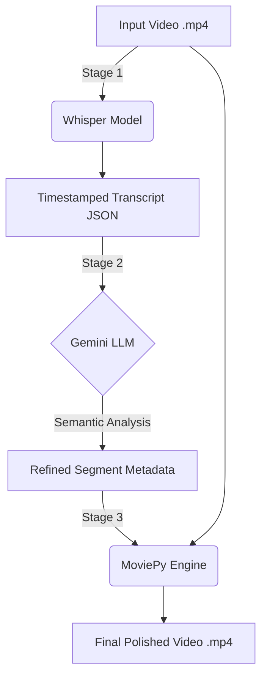

# 🎬 LLM-Assisted Video Editing Pipeline

**An end-to-end intelligent video processing pipeline that automatically transcribes, analyzes, and edits videos using speech-to-text models and large language models (LLMs).**

This project demonstrates how modern AI models (**OpenAI Whisper** + **Google Gemini**) can be orchestrated with traditional video processing tools to automate semantic video editing — turning raw footage into a refined output with minimal human intervention.

---

## 🚀 Overview

The pipeline is designed as a **3-stage modular system**:

1.  **Transcription**: Convert raw video audio into structured text with timestamp alignment.
2.  **Semantic Analysis**: Use an LLM to understand context, identify meaningful segments, and filter out filler content/silence.
3.  **Automated Editing**: Programmatically trim and merge selected segments into a polished video with smooth transitions.

**Ideal for**:
*   Long-form content cleanup (lectures, podcasts, interviews)
*   Automated highlight generation
*   AI-assisted content workflows

---

## 🧠 Architecture



Each stage is decoupled, making the pipeline easy to extend, debug, or swap models.

---

## ✨ Features

### Stage 1 — Transcription
*   **Engine**: OpenAI Whisper (local execution)
*   **Capabilities**: Robust speech-to-text conversion, handling various accents and background noise.
*   **Output**: High-precision, timestamp-aligned JSON transcripts.

### Stage 2 — Semantic Analysis
*   **Engine**: Google Gemini (via `google-genai` SDK)
*   **Intelligence**: 
    *   Identifies core "meaningful" segments based on context.
    *   Filters out filler words, extensive silences, and off-topic tangents.
    *   Generates metadata including smart **Titles** and **Keywords**.

### Stage 3 — Video Editing
*   **Engine**: MoviePy & FFmpeg
*   **Automation**: 
    *   Parses AI-selected time ranges.
    *   Trims original footage losslessly where possible.
    *   Applies **cross-dissolve transitions** for professional smoothness.
    *   Organizes source files into a `processed/` directory after completion.

---

## 🛠️ Tech Stack

*   **Language**: Python 3.x
*   **AI/ML**: OpenAI Whisper, Google Gemini (GenAI)
*   **Media Processing**: MoviePy, FFmpeg
*   **Concurrency**: `concurrent.futures` for parallel processing
*   **CLI**: `argparse` for robust command-line interaction

---

## ⚙️ Setup & Installation

### 1. Install FFmpeg (Required)
The pipeline requires FFmpeg to be installed and accessible in your system PATH.

#### Windows
1.  Download the **essential build** from [gyan.dev](https://www.gyan.dev/tt/ffmpeg/git-essentials.7z).
2.  Extract the `.7z` file.
3.  Copy `ffmpeg.exe`, `ffplay.exe`, and `ffprobe.exe` from the `bin` folder.
4.  Paste them into the root of this project folder (where `utils.py` is).
    *   *Alternatively, add the `bin` folder to your System PATH to make it accessible globally.*

#### Mac (via Homebrew)
```bash
brew install ffmpeg
```

#### Linux (Ubuntu/Debian)
```bash
sudo apt update && sudo apt install ffmpeg
```

### 2. Install Python Dependencies
```bash
pip install -r requirements.txt
```

### 3. Configuration
Create a `config.json` file in the project root:
```json
{
    "gemini_api_key": "YOUR_GEMINI_API_KEY",
    "model_size": "small",
    "enable_audio_cleaning": true
}
```

---

## ▶️ Usage

### Stage 1 — Transcribe Videos
Scans the `input/` directory for `.mp4` files and generates JSON transcripts.
```bash
python transcribe.py --workers 4
```

### Stage 2 — Analyze & Refine Content
Sends transcripts to Gemini for semantic segmentation and refinement.
```bash
python genai.py
```

### Stage 3 — Cut & Export Video
Uses LLM-selected segments to trim and assemble the final video in `output/`.
```bash
python video_cut.py
```

---

## 📁 Project Structure

```text
├── input/              # Raw input videos (.mp4)
├── output/             # Final edited videos
├── processed/          # Archived source files after processing
├── transcribe.py       # Stage 1: Speech-to-text entry point
├── genai.py            # Stage 2: LLM analysis entry point
├── video_cut.py        # Stage 3: Video editing entry point
├── utils.py            # Shared utility library (Whisper/FFmpeg logic)
├── prompts.py          # LLM system prompts
├── requirements.txt    # Dependencies
└── config.json         # User configuration
```

---

## 🎯 Key Learnings & Impact

*   **AI System Design**: Designed a robust multi-stage pipeline integrating varying AI modalities (Audio & Text) with deterministic media processing.
*   **LLM Decision Making**: Applied LLMs not just for text generation, but for logical decision-making (segment selection) to control a downstream software process.
*   **Media Engineering**: Handled complex media synchronization issues, timestamps, and automated rendering using FFmpeg/MoviePy.
*   **Scalability**: Implemented multiprocessing to handle batch video processing efficiently.

This project reflects skills relevant to **AI/ML Engineering, Applied GenAI, and Automation Systems**.

---

## 🔮 Future Improvements

*   [ ] **Shot-level scene detection**: using vision models to ensure cuts don't happen mid-action.
*   [ ] **Speaker Diarization**: identifying different speakers to allow user-focused editing.
*   [ ] **Web Interface**: A Streamlit/React frontend for non-technical users.
*   [ ] **Subtitle Generation**: Burning AI-generated subtitles into the final video.

---

## 👨‍💻 Author

**Aditya Mhatre**
B.Tech IT Graduate | Aspiring Data Scientist
📍 Mumbai, India

🔗 [LinkedIn](https://www.linkedin.com/in/adityamhatre19) • [GitHub](https://github.com/Adityx1)
